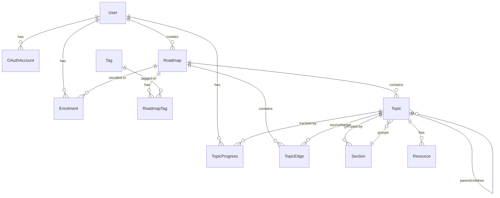

# Data Model

## Entity Relationship Diagram



## Prisma Schema

```prisma
model User {
  id          String    @id @default(uuid())
  email       String    @unique
  displayName String
  avatarUrl   String?
  onboardedAt DateTime?
  createdAt   DateTime  @default(now())

  oauthAccounts OAuthAccount[]
  enrolments    Enrolment[]
  progress      TopicProgress[]
  roadmaps      Roadmap[]
}

model OAuthAccount {
  id            String        @id @default(uuid())
  userId        String
  provider      OAuthProvider
  providerId    String
  providerEmail String?

  user User @relation(fields: [userId], references: [id], onDelete: Cascade)

  @@unique([provider, providerId])
}

enum OAuthProvider {
  GOOGLE
  GITHUB
}

model Roadmap {
  id          String   @id @default(uuid())
  slug        String   @unique
  title       String
  description String?
  isSeeded    Boolean  @default(false)
  isPublished Boolean  @default(false)
  createdById String?
  createdAt   DateTime @default(now())
  updatedAt   DateTime @updatedAt

  createdBy  User?        @relation(fields: [createdById], references: [id])
  tags       RoadmapTag[]
  topics     Topic[]
  edges      TopicEdge[]
  enrolments Enrolment[]
}

model Tag {
  id   String @id @default(uuid())
  name String @unique
  slug String @unique

  roadmaps RoadmapTag[]
}

model RoadmapTag {
  roadmapId String
  tagId     String

  roadmap Roadmap @relation(fields: [roadmapId], references: [id], onDelete: Cascade)
  tag     Tag     @relation(fields: [tagId], references: [id])

  @@id([roadmapId, tagId])
}

model Topic {
  id          String  @id @default(uuid())
  roadmapId   String
  parentId    String? // null = top-level topic; set = sub-topic
  sectionId   String? // optional grouping under a parent topic
  title       String
  description String?
  positionX   Float   @default(0)
  positionY   Float   @default(0)
  order       Int     @default(0)

  roadmap       Roadmap         @relation(fields: [roadmapId], references: [id], onDelete: Cascade)
  parent        Topic?          @relation("SubTopics", fields: [parentId], references: [id])
  children      Topic[]         @relation("SubTopics")
  section       Section?        @relation(fields: [sectionId], references: [id])
  resources     Resource[]
  progress      TopicProgress[]
  outgoingEdges TopicEdge[]     @relation("EdgeSource")
  incomingEdges TopicEdge[]     @relation("EdgeTarget")
}

model Section {
  id            String @id @default(uuid())
  roadmapId     String
  parentTopicId String
  title         String
  order         Int    @default(0)

  topics Topic[]
}

model TopicEdge {
  id        String @id @default(uuid())
  roadmapId String
  sourceId  String
  targetId  String

  roadmap Roadmap @relation(fields: [roadmapId], references: [id], onDelete: Cascade)
  source  Topic   @relation("EdgeSource", fields: [sourceId], references: [id], onDelete: Cascade)
  target  Topic   @relation("EdgeTarget", fields: [targetId], references: [id], onDelete: Cascade)

  @@unique([sourceId, targetId])
}

model Resource {
  id      String       @id @default(uuid())
  topicId String
  title   String
  url     String
  type    ResourceType
  order   Int          @default(0)

  topic Topic @relation(fields: [topicId], references: [id], onDelete: Cascade)
}

enum ResourceType {
  ARTICLE
  VIDEO
  COURSE
}

model Enrolment {
  id                String    @id @default(uuid())
  userId            String
  roadmapId         String
  enrolledAt        DateTime  @default(now())
  unenrolledAt      DateTime? // soft delete — null = active
  lastViewedTopicId String?

  user    User    @relation(fields: [userId], references: [id], onDelete: Cascade)
  roadmap Roadmap @relation(fields: [roadmapId], references: [id], onDelete: Cascade)

  @@unique([userId, roadmapId])
}

// TopicProgress tracks status at both topic and sub-topic level.
// Sub-topics are stored as Topic rows (parentId set), so this model
// covers both without any schema change.
model TopicProgress {
  id        String         @id @default(uuid())
  userId    String
  topicId   String         // can be a top-level topic or a sub-topic
  status    ProgressStatus @default(NOT_STARTED)
  updatedAt DateTime       @updatedAt

  user  User  @relation(fields: [userId], references: [id], onDelete: Cascade)
  topic Topic @relation(fields: [topicId], references: [id], onDelete: Cascade)

  @@unique([userId, topicId])
}

enum ProgressStatus {
  NOT_STARTED
  IN_PROGRESS
  DONE
  SKIPPED
}
```
